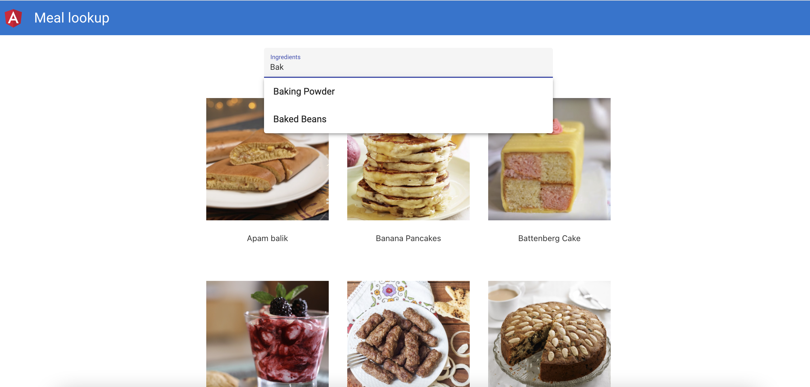
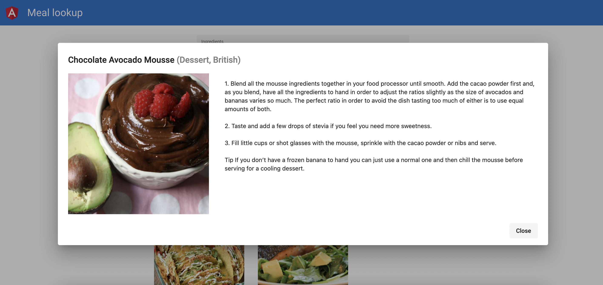

# Meals lookup by ingredient

## Running the app

Run `npm i` and then `ng serve` for a dev server. Navigate to `http://localhost:4200/`.

## Flow description

*Disclaimer*: only `happy flow` is implemented (no error handling)

1) Loading simple initial layout with search field (autocomplete component).

2) To add options to the above field we load ingredients list and add those as autocomplete options.

3) On selection of any ingredient we load a list of recipes and show those on the page.

4) You can click on any recipe and will see the recipe details.

## Screenshots

