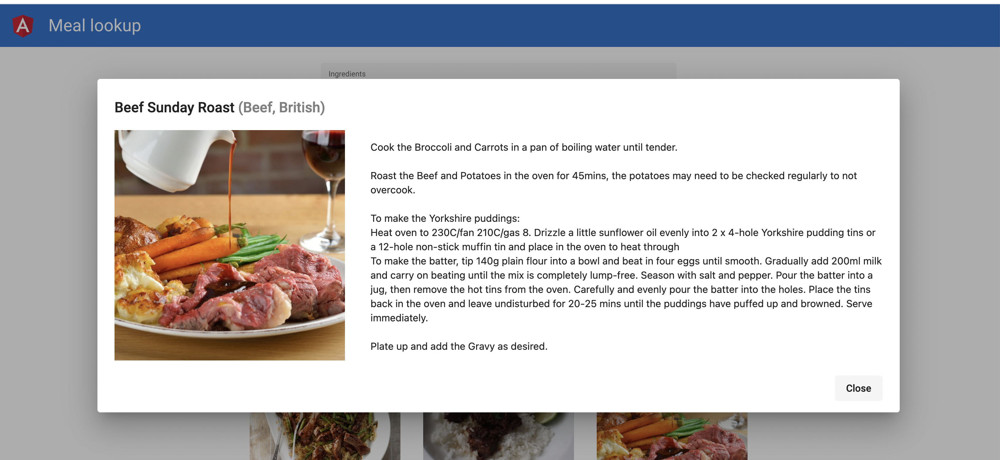

# Meals lookup

## Before starting

`cd meal`

`npm i`

## Running the app

Run `ng serve` for a dev server. Navigate to `http://localhost:4200/`. The app will automatically reload if you change any of the source files.

## Screenshots

